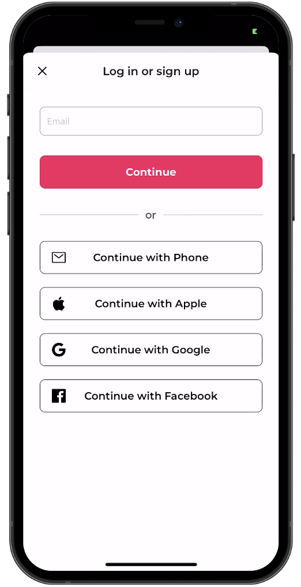
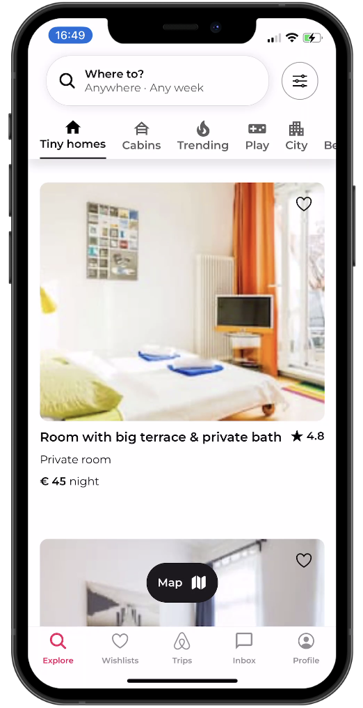
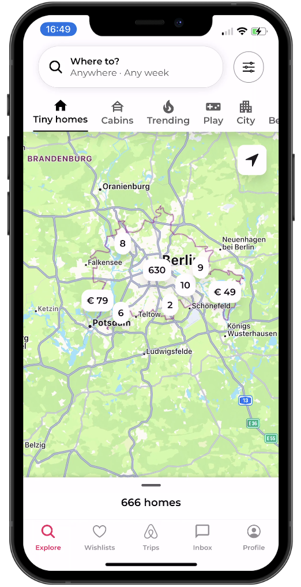
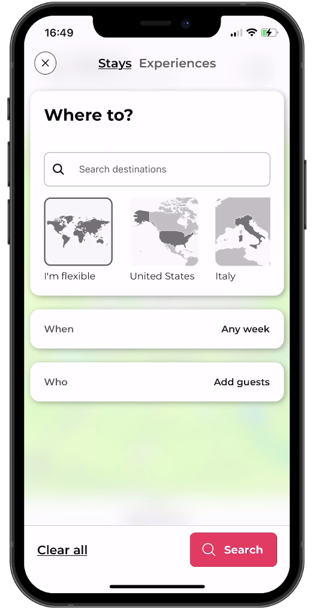
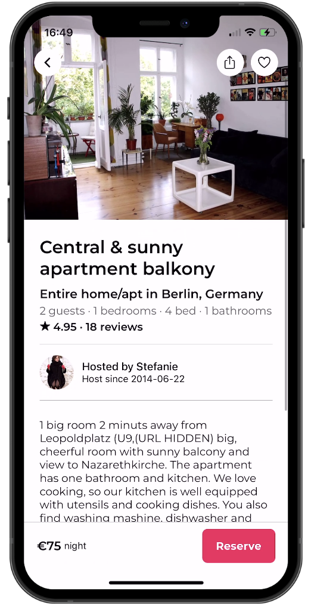

# React Native AirBnB Clone with Clerk

This is a React Native AirBnB clone using [Clerk](https://clerk.dev) for user authentication.

Additional features:

- [Expo Router](https://docs.expo.dev/routing/introduction/) file-based navigation
- [Google](https://clerk.com/docs/authentication/social-connections/google) & [Apple](https://clerk.com/docs/authentication/social-connections/apple) Auth with Clerk
- [Reanimated](https://reanimated-beta-docs.swmansion.com/) 3 for animations
- [MapView](https://docs.expo.dev/versions/latest/sdk/map-view/) with Marker and [Clustering](https://github.com/venits/react-native-map-clustering)
- [Bottom Sheet](https://gorhom.github.io/react-native-bottom-sheet/)
- Modal with Animations and Blurred Background

## Screenshots

## Demo

